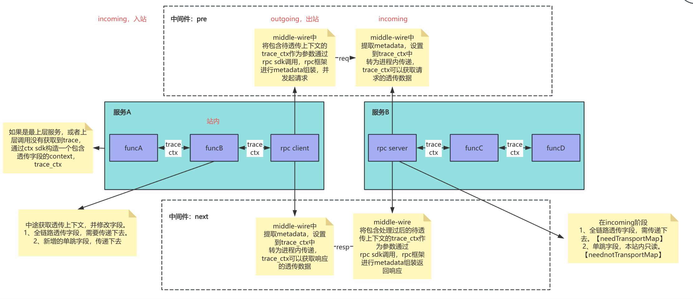

# 项目介绍
#### 项目定位
本项目定位为透明上下文传播库，用于在分布式系统中透传上下文信息，实现跨服务调用的上下文跟踪。

#### 背景
微服务链路中，不同服务之间的调用需要透传上下文信息，实现跨服务的上下文跟踪。但存在以下问题：
1、用户需约定透传字段名称，同时需时刻牢记在进程内使用ctx传递下去（心智负担重）。
2、用户需自行适配不同的微服务链路中间件，将透传上下文从协议的metadata设置到ctx中。
本项目定位为透明上下文传播sdk，用于简化用户在分布式系统中透传上下文信息，实现跨服务调用的上下文跟踪。

#### 项目内容
主要分为以下几个部分：
1、定义了透传上下文结构体。
预定义（全链路透传）Req-All- / Resp-All- 、 （单跳透传）Req-Once- / Resp-Once- 两类透传上下文。其中单跳透传指的是只传递一层。
2、透传上下文的设置和获取。
包装了透传上下文设置到标准库ctx中，以及从标准库ctx中获取透传上下文。
3、透传上下文的传播。
定义了传播器 Propagator，以及传播载体 MetadataCarrier，将传播方法和不同协议metadata的载体进行解耦。
4、常用微服务链路中间件的支持。
定义了支持的微服务链路中间件，包括http（gin）、grpc的中间件。使用sdk封装好的中间件可以自动将透传上下文设置到ctx中，用户不再需要自行设置，减轻了心智负担。

#### 架构

sdk的使用分为三个时机：
1、入站时。
入站时，用户可以使用sdk封装好的中间件，将透传上下文从协议的metadata设置到ctx中。
2、站内。
站内时，用户可以从ctx中获取透传上下文，并进行使用。如果需要设置透传上下文，可以使用SetReqAllByKey等方法设置透传上下文。设置完后，可以将透传上下文再设置回ctx中。
3、出站时。
出站时，用户可以使用sdk封装好的中间件，将透传上下文从ctx中设置到协议的metadata中。

# 验证Demo

本项目包含一个完整的 E2E Demo，模拟了 `Service A (HTTP Client) -> Service B (Gin Server + gRPC Client) -> Service C (gRPC Server)` 的调用链路，用于验证全链路透传（`Req-All`/`Resp-All`）和单跳透传（`Req-Once`/`Resp-Once`）的能力。

#### 运行 Demo

在 `demo` 目录下运行 E2E 测试：

```bash
cd demo
go test -v ./e2e_test.go
```

#### 验证逻辑

测试脚本会启动 Service B 和 Service C，并模拟 Service A 发起 HTTP 请求。验证点如下：

1.  **全链路请求透传 (`Req-All`)**: Service A 设置 `Req-All-TraceID`，验证 Service B 和 Service C 均能接收到该值。
2.  **单跳请求透传 (`Req-Once`)**:
    *   Service A 设置 `Req-Once-From: ServiceA`，验证 Service B 接收到该值。
    *   Service B 设置 `Req-Once-From: ServiceB`，验证 Service C 接收到该值（Service C 不应收到 Service A 的值）。
3.  **全链路响应透传 (`Resp-All`)**: Service C 设置 `Resp-All-TraceID`，验证 Service A 能在响应头中接收到该值。
4.  **单跳响应透传 (`Resp-Once`)**: Service B 设置 `Resp-Once-From: ServiceB`，验证 Service A 能在响应头中接收到该值。

# SDK 使用

#### 1. 安装

```bash
go get github.com/shuaibizhang/transparent-context
```

#### 2. 服务端接入 (Server Middleware)

**Gin (HTTP)**

```go
import "github.com/shuaibizhang/transparent-context/middleware/httpmiddleware"

r := gin.Default()
// 注册中间件，自动从 Header 提取透传 Context 到 Go Context
r.Use(httpmiddleware.TransparentContextMiddleware())
```

**gRPC**

```go
import "github.com/shuaibizhang/transparent-context/middleware/grpcmiddleware"

s := grpc.NewServer(
    // 注册拦截器，自动从 Metadata 提取透传 Context 到 Go Context
    grpc.UnaryInterceptor(grpcmiddleware.TransparentContextUnaryServerInterceptor()),
)
```

#### 3. 客户端接入 (Client Injection)

**HTTP Client**

```go
import "github.com/shuaibizhang/transparent-context/middleware/httpmiddleware"

// 发起请求前，将 Context 中的透传数据注入到 Header
httpmiddleware.InjectToHttpClientHeader(ctx, req.Header)
client.Do(req)
```

**gRPC Client**

```go
import "github.com/shuaibizhang/transparent-context/middleware/grpcmiddleware"

conn, err := grpc.NewClient("target",
    // 注册拦截器，自动将 Context 中的透传数据注入到 gRPC Metadata
    grpc.WithUnaryInterceptor(grpcmiddleware.TransparentContextUnaryClientInterceptor()),
)
```

#### 4. 业务逻辑中使用 (In-Process)

在业务代码中，通过 `context` 获取和设置透传数据：

```go
import transparentcontext "github.com/shuaibizhang/transparent-context/context"

func Handler(ctx context.Context) {
    // 1. 获取 TransparentContext
    tc := transparentcontext.GetTransparentContext(ctx)
    if tc == nil {
        return
    }

    // 2. 获取请求透传数据
    traceID := tc.GetReqAllByKey("TraceID") // 获取全链路透传数据
    from := tc.GetReqOnceByKey("From")      // 获取单跳透传数据

    // 3. 设置请求透传数据 (将传递给下游)
    tc.SetReqAllByKey("UserID", "1001")
    tc.SetReqOnceByKey("From", "MyService")

    // 4. 设置响应透传数据 (将返回给上游)
    tc.SetRespAllByKey("ProcessTime", "100ms")
    tc.SetRespOnceByKey("Status", "OK")
}
```